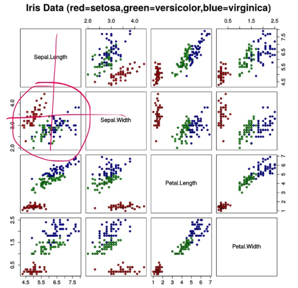
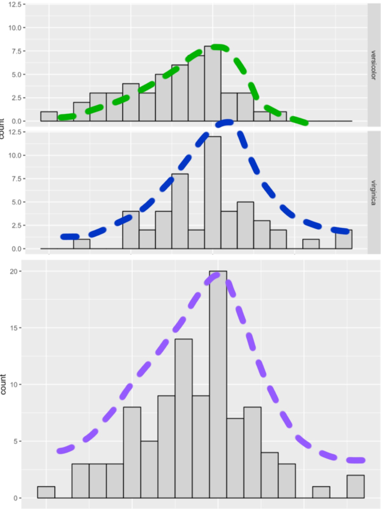
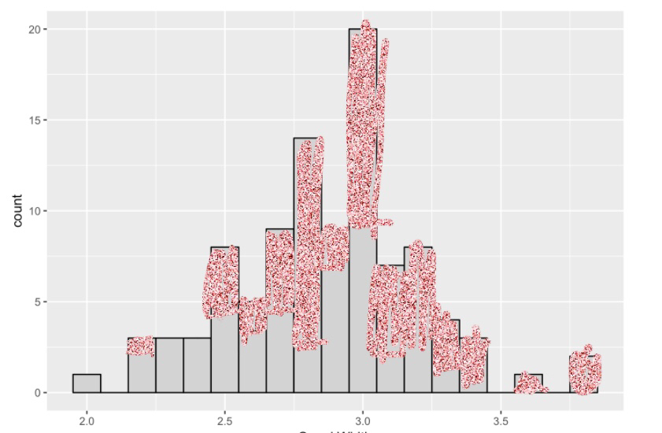
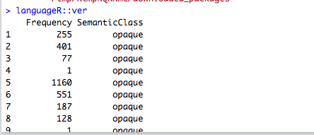

##Exercice1
I wanted to creat a SSH key, and I did creat one but I don't know how to use it,always error messages.....

##Exercice2
```{r}
possible_outcomes <- c(0, 1, 2, 3, 4, 5)
outcome_probabilities <- c(0.1, 0.5, 0.2, 0.1, 0.05, 0.05)
n_data_points <- 400

set.seed(1)
fake_data_points <- sample(possible_outcomes,
                           n_data_points,
                           replace=T,
                           prob=outcome_probabilities)
set.seed(NULL)

fake_data_set <- tibble::data_frame(`Fake measurement`=fake_data_points)
```
My guess for Chunk1 of R is that : this chunk genere a set of numbers combined by 0,1,2,3,4,5, the probabilities of these numbers in this set are the values in vector outcome_probabilities and respectively ---->0(0.1),1(0.5),2(0.2),3(0.1),4(0.05),5(o.o5), and the number of items of this set is absolutely under 400, which is the value of n_data_points. This set of numbers is randomly generated with different number of itmes, colonnes and lines, but the total number of items is always less than or equals to 400. I have this guess because:

* first, according to the video I know '<-' is to defin a variable, so I know possible_outcomes, outcome_probabilities and fake_data_points are vectors who have a set of variables, and n_data_points is a variable just have one value. For these variables, their names give me the impression what they are.

* seconde, I run this chunk and generate a set of numbers composed by items of possible_outcomes, and this set has 40 items every line and the last line stared with 361, that reminds me the number of n_data_points, so I guess this variale defin the biggest number of items in this set.

* third, in the beginning this chunk counld't be run because lack of the package "tibble", and I search the information of this package in Internet, then I know this packge is to create data frames, and the parametres of this function are defined in fake_data_points.

* fourth, the fake_data_points is generated by a function named "sample", and I learn in Internet that "sample"" function is for taking a sample of the specified size from a bunch of variables(a vector). The grammair is sample(the variables we take, the size, replace = FALSE, prob = NULL/we can define)

* fifth, what I'm not very clear is the function "set.seed". When I delete the set.seed(1), in the result there are totally 400 lines and one variable every line, from this I can understand what the Internet say "useful to creating random objects that can be reproduced." But I'm  a little confused by other explications.

```{r}
ggplot2::ggplot(fake_data_set, ggplot2::aes(x=`Fake measurement`)) +
  ggplot2::geom_histogram(bins=5, colour="black", fill="lightgrey")
```

##Exercice3

**Question 3a**

```{r out.width='50%', echo=FALSE}

```

According the description of Iris flower data set, we can know that the morphologic variation of Iris flowers of three related species is defined by four features: the length and the width of the sepals and petals, and every morphologic variation has different combinaition of length and the width of the sepals and petals, for example, from the Iris dataset scatterplot.svg, on one hand,we can see with one width of sepals but different length of the sepals there might be three variation: when the sepal width is 3.0, when length of the sepals is 4.5, it's setosa, when length of the sepals is 5.5, it might be versicolor or virginica, to seperate those two kinds it should look other two features, and when length of the sepals is 7.5, it's definitely virginica. One another hand, we can see that one variation has different values for one feature, for example the sepals lenght of virginica varies from 4 to 8. When we understand the Iris dataset scatterplot.svg, it'll be easy to undertand those histogrammes.

In those histogrammes the X axe is the width of Sepal, the Y axe is the number of the variation in a certain width of Sepal, and each histogramme for one variation(versicolor and virginica). From those two histogrammes we can compare the distribution of each variation in different width of Sepal. For example, in 50 examples of virginica, there are 12 items with the width of Sepal of 3. The R can help us to see that more easily:

```{r echo=FALSE}
library(magrittr)
iris_versicolor_subset <- dplyr::filter(iris,
                                        Sepal.Width == 3,
                                        Species == "virginica") %>%
                          dplyr::select(Sepal.Width, Species)
knitr::kable(iris_versicolor_subset)
```

From this table, we can see the number of virginica when the width of Sepal equals 3 is exactly 12. So the bar of histogramme tells us the number of the varation in one width of Sepal when there are totally 50 examples for each variation. For example in the histogramme Virginica, we can see the number of this kind of iris in different width of Sepal:

* lenght:2.2--->number:1
* lenght:2.5--->number:4
* lenght:2.6--->number:2
* lenght:2.7--->number:4
* lenght:2.8--->number:8
* lenght:2.9--->number:2
* lenght:3--->number:12
* lenght:3.1--->number:4
* lenght:3.2--->number:5
* lenght:3.3--->number:3
* lenght:3.4--->number:2
* lenght:3.6--->number:1
* lenght:3.8--->number:2
* total examples--->50

**Question 3b**

To verify that the two small histograms add up to the big one, I chose 4 bins:the width of Sepal=2, 2.5, 3, 3.5.

From the first small histogram, we know that for Versicolor, with the width of Sepal 2, 2.5, 3, 3.5, the numbers are respectively:1, 4, 8, 0.

From the second small histogram, we know that for Virginica, with the width of Sepal 2, 2.5, 3, 3.5, the numbers are respectively:0, 4, 12, 0.

From the big histogram, we can see the value of the bin of 2, 2.5, 3, 3.5 are respectively 1(=1+0), 8(=4+4), 20(8+12), 0(=0+0), this is exactely the sum of the values of these two kinds in these four width.

**Question 3c**

I think that the hypothesisA means the virginica and versicolor iris species have the same distributions with different width of sepal varies, like for these two kinds when the lenght is under 3 they both have a tendance that the number of examples increases, and after 3,  they both have a tendance that the number of examples reduces. For hypothesisB, I think that means virginica and versicolor iris species have the different distributions with different width of sepal, for example for versicolor when width of sepal bigger than 3.5, no more example existe while for the Virginica there still 3 examples. (In fact, I don't very understand this question...)

**Question 3d**

I'm in favor of hypothesisA: The virginica and versicolor iris species are the same in terms of sepal width. Because:

* I find that the histogramme of these two variations have a relatively similar trend of change with each other and with the hitogramme pooled, all histogrammes like a little montain:

```{r out.width='50%', echo=FALSE}

```

* The distribution of these two kinds of iris are relatively like "the samething twice":

```{r out.width='50%', echo=FALSE}

```

We can see from the picture a little ugly the distribution of these two kinds(the red part is Virginica, and the rest is Versicolor), it's nearly "the samething twice".

##Exercice4

```{r echo=FALSE}
ggplot2::ggplot(stressshift::stress_shift_permit,
                ggplot2::aes(x=Category, fill=Syllable)) +
  ggplot2::geom_bar(position="dodge", colour="black") + 
  ggplot2::scale_fill_brewer(palette="Set3")
```

```{r echo=FALSE}
ggplot2::ggplot(stressshift::stress_shift_permit, ggplot2::aes(x=0, fill=Syllable)) +
  ggplot2::geom_bar(position="dodge", colour="black") + 
  ggplot2::scale_fill_brewer(palette="Set3") +
  ggplot2::xlab("") +
  ggplot2::theme(axis.text.x=ggplot2::element_blank(),
                 axis.ticks.x=ggplot2::element_blank()) +
  ggplot2::xlim(c(-1,1))
```

**Question4a**

I think that hypothesis A means that the word permit has same frequence of stress in two syllabes when it as noun and verb: that means if "permit" has 20 stress in syllabe1 amoung 50 times of prononciation when it's noun, so when it's verb the times when "permit" has stress in syllabe1 are close to 20  amoung 50 times of prononciation. For the hypothesis B, I think that means that the word permit has different frequences of stress in two syllabes when it as noun and verb, for example: if "permit" has 20 stress in syllabe1 amoung 50 times of prononciation when it's noun, so when it's verb the times when "permit" has stress in syllabe1 might be 1 amoung 50 times of prononciation.

**Question 4b**

I'm in favor of hypothesis B, because:
* Simply these three histogrammes look visually very different. 
* In the last histogrammes comes from the two first histogrammes, its structure has no similarity with those two first histogrammes, we can't know the situation for the frequence of stress in two syllabes of permit from the last histogramme.

##Exercice5
**Question 5a**

```{r echo=FALSE}
library(magrittr)
set.seed(1)
ver_balanced <- languageR::ver %>%
  dplyr::group_by(SemanticClass) %>%
  dplyr::sample_n(198)
set.seed(NULL)
ggplot2::ggplot(ver_balanced, ggplot2::aes(x=Frequency)) +
  ggplot2::geom_histogram(fill="lightgrey", colour="black", binwidth=250) +
  ggplot2::facet_grid(SemanticClass ~ .)
```


I get know this data by printing out the languageR::ver:

```{r echo=FALSE}

```

We can see there are three data: the index of word, the frequency of word, the class of word. In the histogramme, the X axe is the frequency and each bin width is 250, so the first bin in the histogramme present the number of word who has the frequency under or equal 250, and the seconde is between 251 and 500...so the two kinds of counts involved in generating this data set are the frequency and the number of word in certain frequency(each section of frequency is 250), and in the data package languageR::ver, there are totally 985 words, but the dplyr::sample_n(198) defines there are only 198 samples for each class semantic.

**Question 5b**

I think that hypothesis A means that the ver- verbs in two different class semantic have similary distribution in different frequency, for example: in these 198 paires of samples, they have nearly 100 words in the frequency under 250. For  hypothesis B, I think that's mean that the ver- verbs in two different class semantic have different distribution in different frequency, for example: among 198 paires of samples, the opaque verb has all the 198 words in frequency of 20000 while the transparent verb has all the 198 words in frequency under 250.

**Question 5c**

I assume that hypothesis A is right.

* First, we can see easily thes two histogrammes look visually similar, and they have the almost the same pattern of developping: the number of words reduces from the frequency section under 250 to more than 20000

*Second, I try to print the histogramme without the class semantic, so we can say the two histogramme of different class semantic histogrammes pooled to become this one:
```{r echo=FALSE}
library(magrittr)
set.seed(1)
ver_balanced <- languageR::ver %>%
  dplyr::group_by(SemanticClass) %>%
  dplyr::sample_n(198)
set.seed(NULL)
ggplot2::ggplot(ver_balanced, ggplot2::aes(x=Frequency)) +
  ggplot2::geom_histogram(fill="lightgrey", colour="black", binwidth=250)
```

We can see this histogramme has almost the same structure with the other two histogrammes. 

##Exercice6